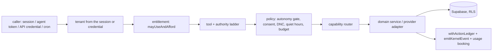
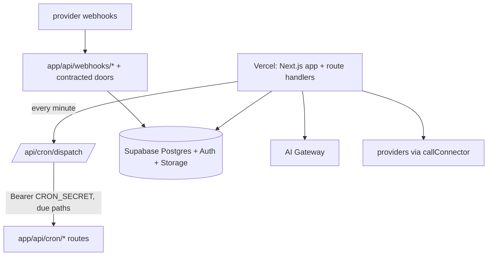

# Production architecture (wave 138, lane 138F)

This is the shipped system as it stands at base `2fc959f0c`, written for the production release. The laws it runs under are in `docs/architecture/OS-CONSTITUTION.md`, which stays the survivor for laws and principles. This page holds the deployed shape, the extension and self-healing models, the security and evidence rails, and the runbook.

Every claim cites `file:line`. `npm run test:production-readiness` (`scripts/production-readiness-guard.ts`) fails if a cited file or line stops existing, or if the env table, the RLS backstop or the heap numbers below disagree with the code.

## 1. The seven layers mapped to modules

These are the owner's seven layers (wave 100 ruling). Each row names the survivor module that implements the layer.

| # | Layer | Survivor (entry point) |
|---|---|---|
| 1 | SaaS control plane | Access and entitlement: `mayUseAndAfford` `lib/billing/billing-access.ts:313` (a missing subscription row fails closed: `lib/billing/billing-access.ts:79`). Tenant policy versions: `appendTenantPolicyVersion` `lib/kernel/tenant-policy.ts:323`. Impersonation: `lib/platform/impersonation.ts:63`. Go-live readiness: `runGoLiveReadiness` `lib/platform/go-live-readiness.ts:46`. |
| 2 | Agentic kernel | The 14 managers: `MANAGERS` `lib/kernel/manager-registry.ts:82`, with ownership maps `MAINTENANCE_DOMAINS` (`:599`), `TABLE_MANAGER` (`:1832`) and `CRON_MANAGER` (`:2768`). Events: `emitKernelEvent` `lib/kernel/emit.ts:154` and `KernelEvent` `lib/kernel/events.ts:17`, reacted to by `dispatchKernelEvent` `lib/kernel/event-reactor.ts:95`. Evidence: `withActionLedger` `lib/kernel/action-ledger.ts:532`. Missions: `createMission` `lib/kernel/missions.ts:460`. |
| 3 | Real-estate intelligence graph | Person identity: `resolvePerson` `lib/kernel/person-identity.ts:181`. Relationships: `upsertRelationship` `lib/kernel/relationship-graph.ts:245`. Memory: `loadContactMemoryForPrompt` `lib/kernel/conversation-memory.ts:633`. Context compiler: `compileManagerContext` `lib/kernel/mission-context.ts:291`. |
| 4 | Capability / provider fabric | Route table: `CONTACT_PROVIDER_ROUTES` `lib/ai-isa/property-lookup-rail.ts:314`. Router: `routeCapability` (`:385`). AVM: `requestPropertyValuation` `lib/avm/provider-chain.ts:299`. One egress: `callConnector` `lib/agentic-os/connector-gateway.ts:218`, with health from `deriveProviderHealth` (`:394`). Adapters: `deriveProviderAdapters` `lib/kernel/provider-adapters.ts:177`. Registry: `CONNECTOR_REGISTRY` `lib/agentic-os/connector-registry.ts:68`. |
| 5 | Education / competency | `COMPETENCY_SKILLS` `lib/education/skill-freshness.ts:130`. |
| 6 | Performance / economic | `loadEconomicGraph` `lib/kernel/economic-graph.ts:504`. Attribution: `loadLedgerAttribution` `lib/intelligence/roi-ledger.ts:323`. |
| 7 | Learning / digital twin / mission | Twin: `buildBrokerageTwin` `lib/kernel/brokerage-twin.ts:1596`. Learning classes: `OPTIMIZATION_CLASSES` `lib/kernel/self-optimization.ts:46`. Strategies: `lib/kernel/strategy-library.ts:39`. Budget envelopes: `AUTONOMY_ENVELOPES` `lib/kernel/autonomy-budgets.ts:42`. |

## 2. The kernel request path

Every consequential request takes the LAW 4 chain. The diagram shows that chain.

1. **Edge.** `proxy.ts:150` lets `classifyProxyPath` (`app/constants/auth.ts:271`) decide whether a request is public, protected or open. Public-by-name routes are listed at `app/constants/auth.ts:88`, and sessionless provider doors at `app/constants/auth.ts:69`. A protected path without a session is redirected (`proxy.ts:164`).
2. **Tenant.** The tenant comes from the session (`requireCallerTenant` `lib/auth/require-caller.ts:381`; writes go through `resolveWriteContextForTenant` `lib/platform/acting-context.ts:326`). An API caller's tenant comes from its credential (`resolveAgenticCaller` `lib/agentic-os/agent-credentials.ts:80`; `serveDomainApi` `lib/kernel/domain-api.ts:154`, mounted at `app/api/v1/[resource]/route.ts:7`).
3. **Entitlement.** `mayUseAndAfford` `lib/billing/billing-access.ts:313`. Usage caps: `checkUsageCap` `lib/usage/check-cap.ts:49`.
4. **Tool and authority.** Tools are chosen by persona (`selectToolsForPersona` `lib/ai-isa/persona-tool-policy.ts:595`) and classed by risk (`riskClassForTool` `lib/ai-isa/persona-tool-policy.ts:756`). The authority level comes from `resolveAgentAuthorityLevel` `lib/managers/autonomy-gate.ts:298`.
5. **Policy.** `autonomyDecision` `lib/managers/autonomy-gate.ts:91`, then the send gates in `lib/providers/dispatch.ts:492`.
6. **Capability.** `routeCapability` `lib/ai-isa/property-lookup-rail.ts:385`, then `callConnector` `lib/agentic-os/connector-gateway.ts:218`.
7. **Evidence and cost.** `withActionLedger` `lib/kernel/action-ledger.ts:532`, `emitKernelEvent` `lib/kernel/emit.ts:154`, `logAIUsage` `lib/ai/cost-tracking.ts:154`, `meterVendorSpend` `lib/vendor-governance/meter-vendor.ts:46`.

No LLM reaches SQL directly. The model proposes, and the domain services above enforce (`docs/architecture/OS-CONSTITUTION.md:49`).

## 3. Extension model (one lifecycle, governed contracts)

| Extension | Contract / survivor | Governance |
|---|---|---|
| Domain API | `serveDomainApi` `lib/kernel/domain-api.ts:154` | Tenant from the credential, a per-credential rate limit, scopes, `mayUseAndAfford`, and an evidence row. |
| Outbound webhooks | `postSignedWebhook` `lib/platform/tenant-webhooks.ts:79`, `enqueueTenantWebhookDeliveries` (`:147`), `drainTenantWebhookDeliveries` (`:516`) | HMAC-signed, with rotation overlap and a backoff ladder. Drained by the `/api/cron/webhook-deliveries` cron. |
| Inbound webhooks | `WEBHOOK_CONTRACT` `lib/providers/webhook-contract.ts:101` | Every door is signature- or secret-verified (census W in the readiness guard; scheme truth in `test:webhook-contract`). |
| Provider adapters | `deriveProviderAdapters` `lib/kernel/provider-adapters.ts:177`, `adapterFor` (`:193`) | Reached only through the router and the gateway (LAW 3). |
| Skills | `lib/kernel/skill-registry.ts:47`, marketplace `submitSkillListing` `lib/kernel/skill-marketplace.ts:236` → `evaluateSkillListing` (`:274`) → `decideSkillListing` (`:296`) → `setTenantExtensionEnabled` (`:340`) | One lifecycle: submit, evaluate, decide, then enable per tenant. |
| Custom managers | `MANAGERS` `lib/kernel/manager-registry.ts:82` | No new managers are added to prove anything (wave 137 ruling). |

## 4. Self-healing model — what heals itself vs what goes to a human

`decideRecovery` `lib/kernel/os-health.ts:160` is the single decision point for recovery. It runs over the classes in `INCIDENT_CLASSES` (`lib/kernel/os-health.ts:54`), which the detectors in `HEALTH_DETECTORS` (`lib/kernel/os-health.ts:61`) feed. The supervisor is `runOsHealthSupervisor` `lib/kernel/os-health.ts:909`, ticked from the reaper net (`lib/intelligence/reaper-net.ts:242`).

| Heals itself | Goes to a human (or its accountable manager) |
|---|---|
| A transient failure on an idempotent action is retried up to the cap (`lib/kernel/os-health.ts:183`). | **Money**: the writer is halted and Finance reviews. The OS never corrects money (`lib/kernel/os-health.ts:164`). |
| A rate limit gets exponential backoff (`lib/kernel/os-health.ts:191`). | **Compliance** findings go to the Compliance Officer (`lib/kernel/os-health.ts:175`). |
| A failing provider fails over through `routeCapability` (`lib/kernel/os-health.ts:196`). Provider repair runs through `healProviderFailure` `lib/agentic-os/connector-healer.ts:257` from the connector-health cron (`app/api/cron/connector-health/route.ts:300`). Config-level alternates are auto-applied (`applyDeclaredAlternate` `lib/agentic-os/connector-auto-applier.ts:47`). Code-level fixes become proposals (`proposeConnectorHealing` `lib/agentic-os/connector-healer.ts:59`). | **Data conflicts** go to the Data Steward and are never overwritten (`lib/kernel/os-health.ts:177`). |
| A stuck workflow whose next step never started is resumed (`lib/kernel/os-health.ts:201`). | **Unknown**, **non-idempotent** or **over-the-cap** cases go to a human (`lib/kernel/os-health.ts:179`). Per the wave 138 ruling, anything that crosses tenants or is a security breach always goes to a human. |

## 5. Security and tenancy boundaries

- **Tenant from the session, fail closed.** See `lib/auth/require-caller.ts:381` and CLAUDE.md §4. The tenant-admin roster is defined at `lib/auth/resolve-user-role.ts:286`.
- **The service client is used only after a gate.** `createServiceClient` `lib/supabase/service.ts:4` throws when its env is unset.
- **RLS.** Live census (read-only, 2026-10-07, project `hrvaqgvukzxfskkcrwbt`): 767 public base tables, 767 with RLS enabled, 0 without. 56 of those tables have RLS and no policy, so `anon` and `authenticated` are denied and only the service role can reach them. The live backstop is the `ensure_rls` event trigger (`ddl_command_end` → `public.rls_auto_enable()`), which enables RLS on every new `public` table. That trigger lives **only in the live database and no repository file creates it** (see the runbook: a rebuilt environment must turn it back on). Policy-shape guards: `test:rls-public-grant`, `test:rls-anon-escape`.
- **Webhooks** are verified per `lib/providers/webhook-contract.ts:101`. There are 32 contracted doors and none is unverified (readiness census W).
- **Public writes.** Every writer route the proxy does not session-gate is gated, throttled with `checkPublicRateLimit` `lib/security/public-rate-limit.ts:61`, or classified with a reason (census P). The limiter keeps its counters per instance (`lib/security/public-rate-limit.ts:9`). A distributed limiter is wave-138D work.
- **Client bundles.** No secret-shaped `NEXT_PUBLIC_*` name exists outside the classified public keys, and no `"use client"` module reads a server env var (census N). Demo sign-in is hard-gated off in production (`app/constants/auth.ts:284`).
- **Secrets at rest** use AES-256-GCM envelopes (`encryptSecret` `lib/security/secret-crypto.ts:43`, `decryptSecret` `lib/security/secret-crypto.ts:57`). The rotation monitor is `loadRotationRisks` `lib/security/credential-rotation.ts:73`.

## 6. Data, evidence, cost and usage rails

| Rail | Survivor |
|---|---|
| Action evidence | `withActionLedger` `lib/kernel/action-ledger.ts:532` (`agent_action_ledger`) |
| Events and causation | `emitKernelEvent` `lib/kernel/emit.ts:154` |
| AI cost (this is the invoice) | `logAIUsage` `lib/ai/cost-tracking.ts:154` (`ai_tool_usage`). Model routing: `AI_TASK_ROUTING` `lib/ai/models.ts:118`. |
| Vendor spend | `meterVendorSpend` `lib/vendor-governance/meter-vendor.ts:46` |
| Usage caps | `checkUsageCap` `lib/usage/check-cap.ts:49` |
| Outcome attribution | `loadLedgerAttribution` `lib/intelligence/roi-ledger.ts:323` |
| Errors | `collectError` `lib/errors/collect-error.ts:115` (`automation_errors`). Root UI boundary: `app/error.tsx:30`. |
| Schema truth | Generated caches, never hand-edited (CLAUDE.md §3). Drift is checked by `scripts/schema-cache-drift-guard.ts`. |

## 7. The built-in assistant team

The assistant reaches managers and skills only through governed paths:

- The starter assistant is seeded per tenant (`seedStarterAssistant` `lib/kernel/assistant-starter.ts:26`).
- The staff copilot is `app/api/internal/ai-chat/route.ts:362`. Its tools are persona-selected (`lib/ai-isa/persona-tool-policy.ts:595`).
- Voice commands go through `buildVoicePlan` `lib/voice-admin/kernel-command-surface.ts:261`, over `APP_CAPABILITY_REGISTRY` `lib/agentic-os/app-capability-registry.ts:128`.
- The exceptions-first surface is `loadCommandCenter` `lib/kernel/command-center.ts:390`.

## 8. Deploy topology

- **One platform cron.** `vercel.json` schedules only `/api/cron/dispatch`, every minute. The dispatcher (`app/api/cron/dispatch/route.ts:17`) gates on `verifyCronAuth` (`app/api/cron/dispatch/route.ts:18`) and fans out to `CRON_REGISTRY` (`lib/kernel/cron-dispatch.ts:27`) via `dispatchDueCrons` (`lib/kernel/cron-dispatch.ts:408`). At base there are 222 registry entries over 210 distinct routes, and every one is owned in `CRON_MANAGER`.
- **Build heap.** `vercel.json` builds with `--max-old-space-size=10240`. CI builds with `BUILD_HEAP_MB` defaulting to 14336 (`.github/workflows/build.yml:522`), and the generate step uses 10240 (`.github/workflows/build.yml:616`). The bracket and the exit-134 behaviour are documented at `.github/workflows/build.yml:58`. Re-run unchanged and escalate after three failures at one commit (CLAUDE.md §8).
- **Heavy functions** (Remotion and ffmpeg renders) get 3008 MB and 300 s in `vercel.json` `functions`.

### Required environment (fail-closed behaviour)

| Variable | Fail-closed behaviour |
|---|---|
| `NEXT_PUBLIC_SUPABASE_URL` | The server client throws when it is unset (`lib/supabase/server.ts:11`). The service client also throws (`lib/supabase/service.ts:8`). |
| `NEXT_PUBLIC_SUPABASE_ANON_KEY` | Read by the browser client (`lib/supabase/client.ts:10`) and the server client. Public by design: every row it can reach is RLS-bound. |
| `SUPABASE_SERVICE_ROLE_KEY` | The service client throws "Missing Supabase service role environment variables" (`lib/supabase/service.ts:8`). |
| `CRON_SECRET` | Unset returns 500 and a wrong or missing credential returns 401 (`lib/cron-auth.ts:44`, `lib/cron-auth.ts:49`). |
| `SECRETS_ENCRYPTION_KEY` | Decrypting an envelope throws without it (`lib/security/secret-crypto.ts:61`). **Encrypting is a no-op without it** (`lib/security/secret-crypto.ts:12`), so new secrets are stored in plaintext. Open finding R-2. |
| `INTERNAL_API_SECRET` | Internal intelligence doors refuse 401 when it is unset or wrong (`app/api/intelligence/classify/route.ts:12`). |
| `STRIPE_SECRET_KEY` | `getStripe` throws (`lib/stripe.ts:100`). |
| `AI_GATEWAY_API_KEY` | The model factory throws (`lib/ai/models.ts:46`). |
| `NEXT_PUBLIC_APP_URL` | The canonical origin for links and webhook URLs, read at `proxy.ts:123`. |

Webhook secrets: each env name in `WEBHOOK_CONTRACT.secretEnv` is written in `.env.example` (census E4). The whole-tree parity check is `test:env-var-parity`.

## 9. Operational runbook

**Incident.**
1. Read the OS-health line and the supervisor's incidents (`loadOsHealthLine` `lib/kernel/os-health.ts:1018`).
2. Open the error console (`automation_errors`, written by `lib/errors/collect-error.ts:115`).
3. Check the provider health of the failing capability (`loadProviderHealth` `lib/agentic-os/connector-gateway.ts:444`).
4. Money: a financial writer can be halted per tenant (`haltFinancialWriter` `lib/kernel/os-health.ts:235`). Release the halt only with evidence (`releaseFinancialWriterHalt` `lib/kernel/os-health.ts:262`). Platform staff may release it (wave 137 ruling).
5. Stripe drift is cross-checked by `app/api/cron/stripe-drift/route.ts:34`.

**Rollback.**
- Application: promote the previous Vercel deployment. This changes no data.
- Database: migrations are forward-only. Roll back by writing a new migration that restores the prior shape, applied by the integrator. Never hand-edit a schema cache: regenerate it (`npm run schema:regen`).

**Key rotation.**
- **Webhook signing secrets for tenants** rotate with an overlap pair (`lib/platform/tenant-webhooks.ts:76`).
- **Domain-API credentials** rotate and revoke through the tenant door with ledger evidence (`lib/kernel/domain-api.ts:154`).
- **`CRON_SECRET`.** Set the new value in Vercel and redeploy. The dispatcher and every target read the same variable, so there is no overlap window. Expect one minute of 401s at most.
- **`SUPABASE_SERVICE_ROLE_KEY`.** Roll the key in Supabase, update Vercel, then redeploy.
- **`SECRETS_ENCRYPTION_KEY`.** **There is no rotation path.** Envelopes carry no key id (`lib/security/secret-crypto.ts:19`), so changing the key makes every existing `enc:v1` value undecryptable. Do not rotate until a key-id envelope ships (open finding R-2).
- **Provider OAuth expiry** is surfaced by `escalateRotationRisks` `lib/security/credential-rotation.ts:122`.

**Migration application.**
- Lanes only write migrations. The integrator applies them one statement per `execute_sql` call, never in parallel.
- After a CHECK change, regenerate the vocabulary cache (CLAUDE.md §3).
- **Destructive DDL needs the owner's confirmation.** Standalone `DROP INDEX` / `DROP POLICY` goes in its own file and is held for the owner (example: `supabase/migrations/m739-drop-retired-skill-listing-indexes.sql:5`). `ALTER TABLE … DROP CONSTRAINT` inside an ALTER, `ALTER POLICY` and `CREATE OR REPLACE` go through. Never bypass the confirmation with dynamic SQL.

**New environment / disaster recovery.**
- Recreate the `ensure_rls` event trigger. Either enable Supabase's automatic RLS for new tables, or recreate `public.rls_auto_enable()` and the `ddl_command_end` trigger.
- Set every variable in the env table above, plus the webhook secrets in `.env.example`.
- Point every provider console at the paths in `lib/providers/webhook-contract.ts:101`.
- Restrict the Google Maps browser key by HTTP referrer.

## 10. Readiness findings (lane 138F)

See the lane notes for the full list. At this base:

- **Fixed (P1):** six unauthenticated contact-creating intake doors had no throttle. They now call `checkPublicRateLimit`.
- **Open:**
  - **R-1:** the RLS backstop exists only live.
  - **R-2:** `SECRETS_ENCRYPTION_KEY` is fail-open on encrypt and has no rotation path.
  - **R-3:** QuickBooks still pins `minorversion=73`. Intuit serves 75 for any value below 75 as of 2025-08-01.
  - **R-4:** `app/api/twiml/whisper-bridge/route.ts` verifies Twilio signatures but has no `WEBHOOK_CONTRACT` row.
  - **R-5:** no root global-error boundary (the App Router `global-error` file is absent), and no server `onRequestError` hook into `collectError`.
